# Architecture

Visual companion to `CLAUDE.md`. The diagrams below are deliberately
**generalized**: the shim mirrors 37 IMAS-Core C exports, and drawing each one
would produce a picture nobody reads. Instead they show the *shapes* — one
layering, one type model, one skeleton every data-path seam follows, and the
three ways that skeleton ends (read, write, delete).

Per-seam behaviour stays where it is authoritative: `CLAUDE.md`'s "Where each
seam stands" table for the current policy, `docs/adr/` for why it is that way,
and the module doc comments in `src/` for the code-level contract. When a
diagram here and the code disagree, the code wins — say so in the PR that
proves it.

**Reading order.** §1–§2 are the map. §3–§6 are the type model (UML class
diagrams). §7–§10 are the runtime pipelines (sequence diagrams). §11 is the
context lifecycle.

---

## 1. System context

Where the shim sits, and what it does *not* do. The HLI is compiled against one
DD version for the life of the process; the pulse on disk was written under
another. The shim is the only thing in the picture that knows both.

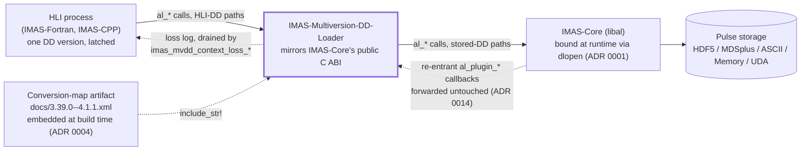

Two asymmetries worth noting on this diagram:

- **The downward arrow is translated, the upward one mostly is not.** Values
  come back through the same buffer IMAS-Core allocated; the shim transforms
  them in place and never substitutes or frees the allocation.
- **The dotted callback arrow is the reason `reentry.rs` exists.** By the time
  IMAS-Core calls back in, the path in flight is already a *stored* path.

## 2. Layer map and the dependency rule

ADR 0015 in one picture: **only `src/interpose/` is C-facing.**
`src/conversion/` and `src/core/` never meet — policy cannot reach IMAS-Core or
process-global state, and the runtime binding makes no conversion decision.

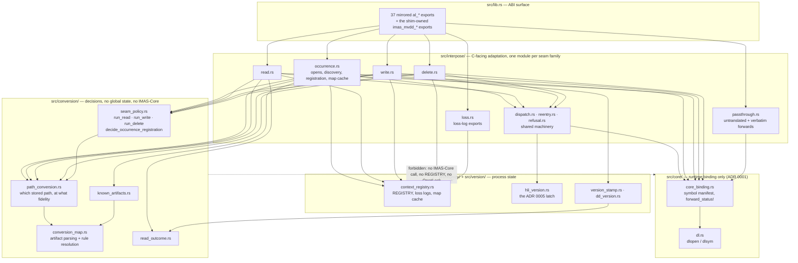

The forbidden edge is not a convention — it is what makes `run_read`,
`run_write` and `run_delete` unit-testable with an injected closure standing in
for IMAS-Core.

## 3. Global class diagram

The load-bearing types, one namespace per owning module. Relationships, not
fields, are the point here; §4–§6 zoom in.

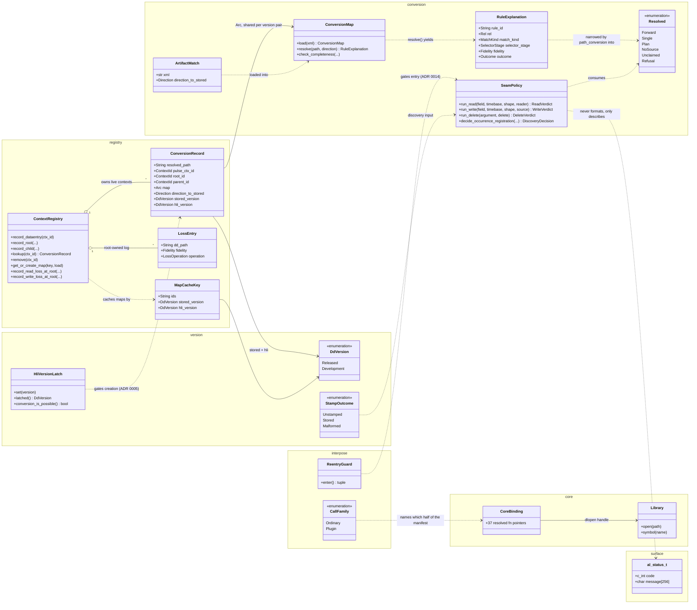

## 4. The conversion-map model (`src/conversion/conversion_map.rs`)

The artifact is the specification of what conversion *is*. This is the widest
part of the type model, and the part a physicist reviewing a rule cares about.

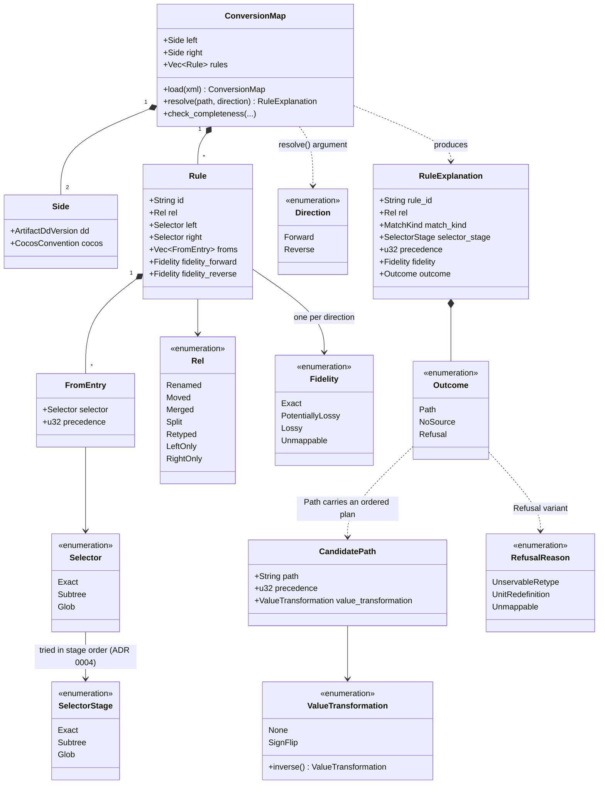

Three rules of this model the picture cannot show, and that are load-bearing:

- **`Retyped` always refuses**, whatever fidelity it declares — the shim cannot
  reshape an int array into an array of identifier structures.
- **Selector stages are tried Exact → Subtree → Glob**, glob only as a fallback
  where neither of the first two applies anywhere in the artifact.
  `RefusalReason::Unmappable` and the glob stage are both *unreachable* from the
  shipped artifact, and tests assert that rather than assume it (ADR 0011).
- **`Fidelity` on a rule is a claim about a read.** The write seam recomputes
  its own verdict; see §10.

## 5. Context registry and version model

Everything process-global lives here, and nothing else in the crate is allowed
to hold state.

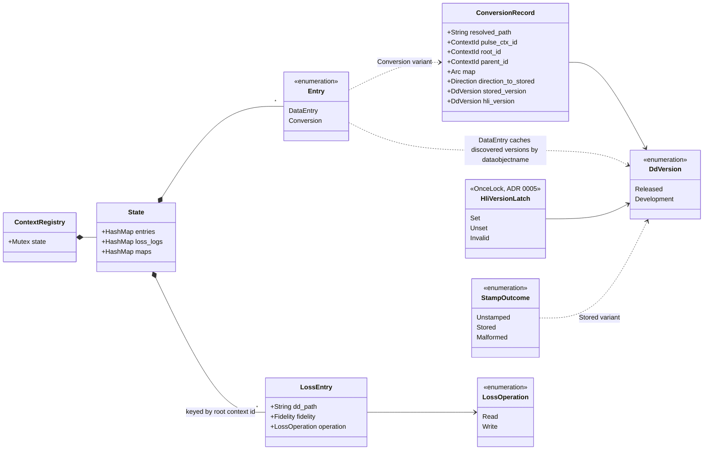

Two invariants the diagram encodes:

- **A loss log belongs to a root**, never to a cloned record — so a child
  arraystruct context contributes to the same eventual report, and a `lookup`
  snapshot can never carry a copied log.
- **The map cache holds `Weak` references**, so a `ConversionMap` lives exactly
  as long as some record references it. No eviction policy is needed or written.

## 6. One resolution, narrowed per seam (ADR 0021)

`path_conversion::resolve` answers one question — *which stored path does this
HLI argument mean, and at what fidelity* — and knows about neither seams nor
IMAS-Core. Each seam then narrows that one answer to the shape it can act on.
This is why adding a seam does not mean adding a resolver.

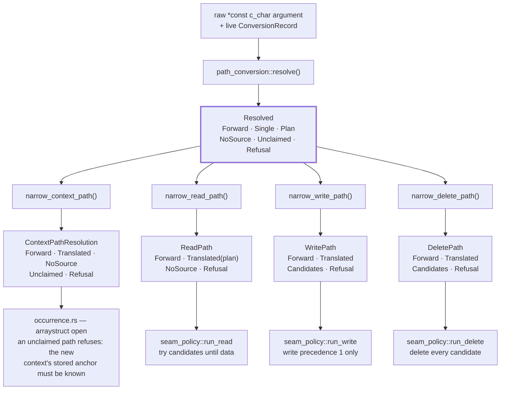

The divergence at the bottom is deliberate and is the heart of ADR 0017: **a
write asserts a value, a delete asserts an absence.** Where a write must not fan
out, a delete must.

## 7. Opening an occurrence and discovering the stored version

Generalizes `al_begin_global_action`, `al_begin_slice_action`,
`al_begin_timerange_action` and their `al_plugin_*` twins — they differ only in
which arguments exist (`datapath` is global-action only) and which ABI symbol
`CallFamily` names.

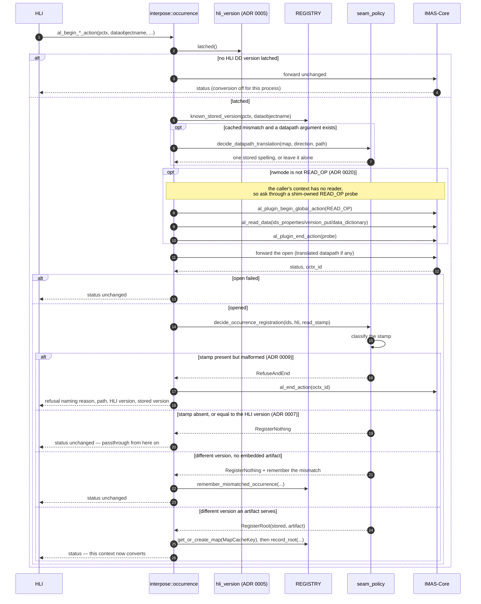

The point of the whole diagram is the branch density: **four of the five
outcomes register nothing.** Conversion is the exception, and the shim pays one
registry lookup to find that out.

## 8. The shared data-path seam skeleton

Read, write and delete pass the same gates before they diverge. Drawing the
gates once is what keeps §9 and §10 short.

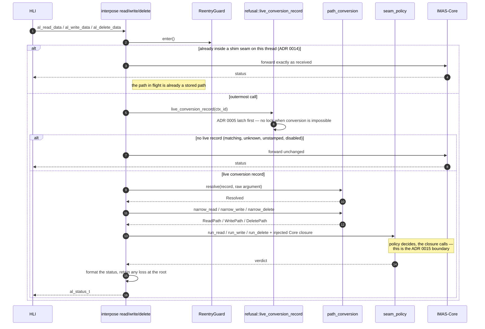

Everything downstream of "live conversion record" is the only part that differs
per seam. The next two diagrams show exactly that part.

## 9. Read: try candidates until one returns data

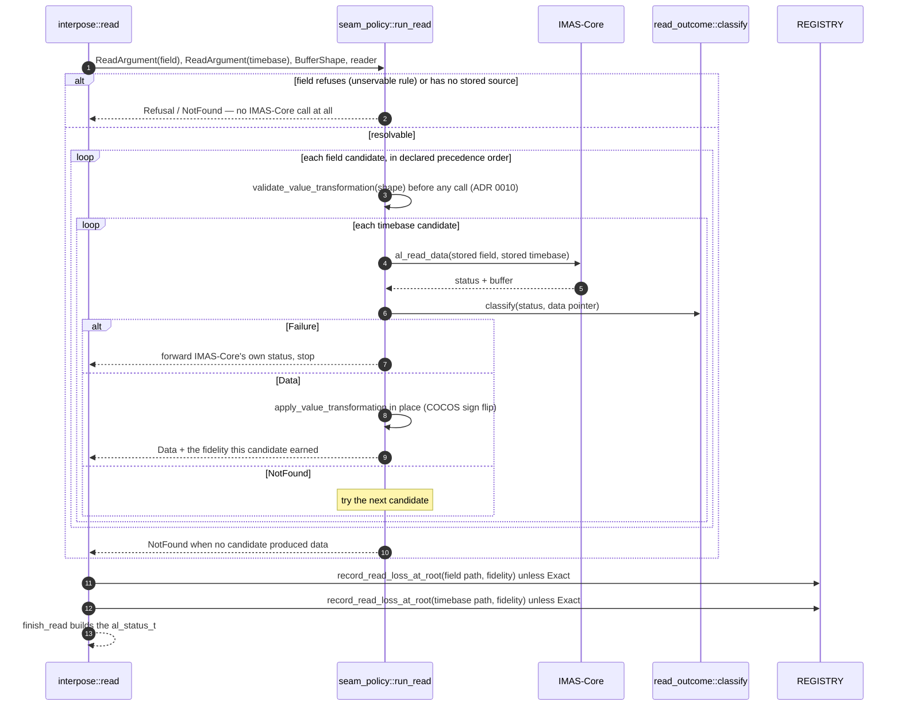

The three-way classification (`Failure` / `NotFound` / `Data`) is ADR 0012 and
lives in exactly one function, because the ABI has two conflicting meanings for
`0` one layer down. A loss entry from a read names **your** path, not the stored
one.

## 10. Write and delete: the same plan, opposite obligations

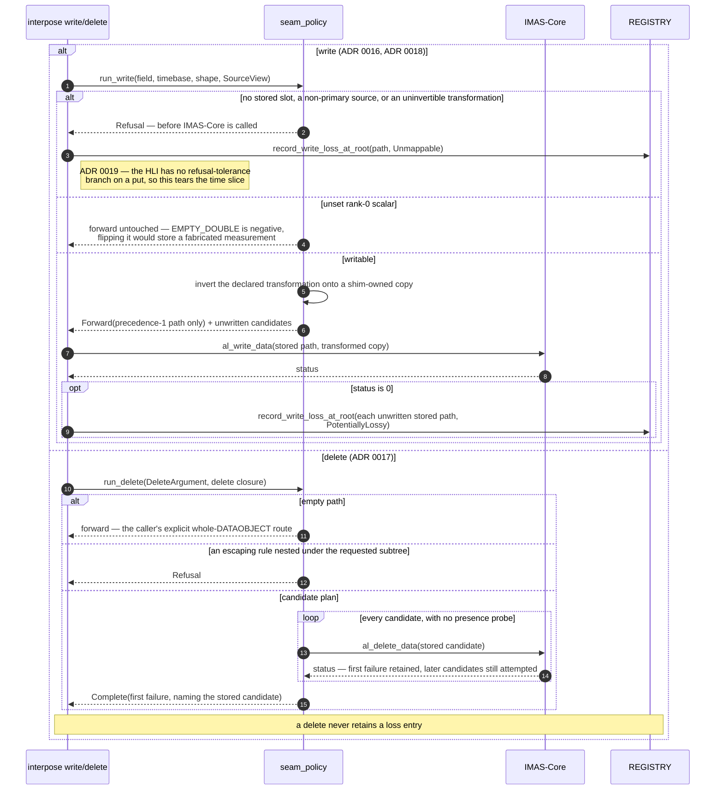

The asymmetry in one line: **a write may touch only precedence 1 and must report
what it left behind; a delete must touch every candidate and reports nothing.**
See also `CLAUDE.md`'s open exposure #139 — real IMAS-Core's HDF5 `deleteData`
ignores its `path` argument, so the fan-out has no per-path effect on the only
backend that implements delete at all.

## 11. Context lifecycle

This is a state machine over **one IMAS-Core context ID**, not over a call
stack: the registry is a flat map keyed by context ID, and a pulse, its
occurrences and their arraystructs each occupy their own ID. IMAS-Core hands
those IDs out of one shared live namespace, so recording at an ID replaces
whatever used it before — which is why every state is reachable directly from
*Untracked*, and why nothing here is a nesting relation.

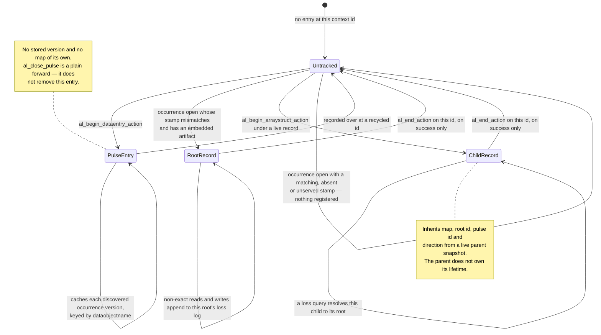

Two consequences worth stating in words, because a state diagram tends to imply
the opposite:

- **Non-LIFO close is safe.** `al_end_action` removes **only its own** record,
  and only when IMAS-Core reports success. Closing a parent before its child
  leaves the child's record intact, and a refused close leaves everything alone.
- **A pulse entry outlives its pulse.** `al_close_pulse` never touches the
  registry, so a `PulseEntry` and its occurrence-version cache persist until
  something is recorded over that ID. The cache exists only to let a later
  re-open of the same occurrence translate `datapath` *before* IMAS-Core is
  called, and it is reset — not inherited — whenever a recycled ID is recorded.

---

## Where to go next

| Question | Authority |
|---|---|
| What does seam X do today? | `CLAUDE.md` → "Where each seam stands" |
| Why does it do that? | `docs/adr/0001`–`0021` |
| What is the exact contract of a function? | the module doc comment in `src/` |
| What did this look like when it was built? | `docs/history/` (frozen; paths have moved) |
| What can IMAS-Core actually do? | `docs/IMAS-CORE_FUNCTIONALITY_INVENTORY.md` |
